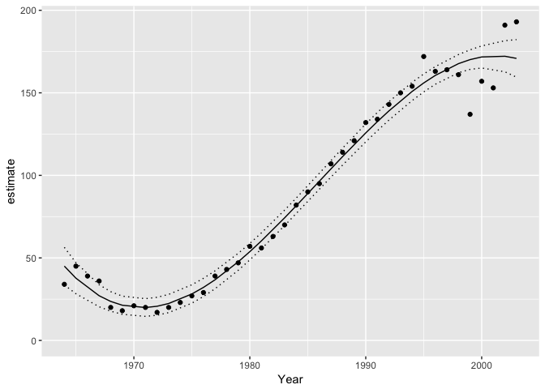

<!-- README.md is generated from README.Rmd. Please edit that file -->
 [](https://travis-ci.org/poissonconsulting/mbr) [](https://ci.appveyor.com/project/poissonconsulting/mbr) [](https://codecov.io/github/poissonconsulting/mbr?branch=master) [](https://opensource.org/licenses/MIT)

mbr
===

Introduction
------------

`mbr` (pronounced MBR) is an R package of utility functions and virtual classes for the model builder family of R packages.

Currently there are packages which implement the functionality for JAGS ([jmbr](https://github.com/poissonconsulting/jmbr)), STAN ([smbr](https://github.com/poissonconsulting/smbr)) and TMB ([tmbr](https://github.com/poissonconsulting/tmbr)).

Demonstration
-------------

``` r
library(magrittr)
library(ggplot2)
library(mbr)
```

``` r
model <- model("Pairs ~ poly(Year, 3)")

model %<>% update_model(
  select_data = list("Pairs" = integer(), "Year*" = integer())
)

analysis <- analyse(model, data = bauw::peregrine)
#> # A tibble: 1 × 5
#>       n     K    logLik     AICc            duration
#>   <int> <int>     <dbl>    <dbl>      <S4: Duration>
#> 1    40     4 -145.5861 300.3151 0.0126180648803711s

coef(analysis)
#> # A tibble: 4 × 7
#>             term  estimate       sd    zscore      lower     upper
#>       <S3: term>     <dbl>    <dbl>     <dbl>      <dbl>     <dbl>
#> 1    (Intercept)  88.42500 1.535653 57.581376   85.31055  91.53945
#> 2 poly(Year, 3)1 345.46759 9.712321 35.570034  325.77009 365.16509
#> 3 poly(Year, 3)2  59.50987 9.712321  6.127255   39.81237  79.20737
#> 4 poly(Year, 3)3 -81.52697 9.712321 -8.394180 -101.22447 -61.82947
#> # ... with 1 more variables: pvalue <dbl>
```

``` r
year <- predict(analysis, new_data = "Year")

ggplot(data = year, aes(x = Year, y = estimate)) +
  geom_point(data = bauw::peregrine, aes(y = Pairs)) +
  geom_line() +
  geom_line(aes(y = lower), linetype = "dotted") +
  geom_line(aes(y = upper), linetype = "dotted") +
  expand_limits(y = 0)
```



Installation
------------

To install from GitHub

    # install.packages("devtools")
    devtools::install_github("poissonconsulting/mbr")

Contribution
------------

Please report any [issues](https://github.com/poissonconsulting/mbr/issues).

[Pull requests](https://github.com/poissonconsulting/mbr/pulls) are always welcome.

Please note that this project is released with a [Contributor Code of Conduct](CONDUCT.md). By participating in this project you agree to abide by its terms.
