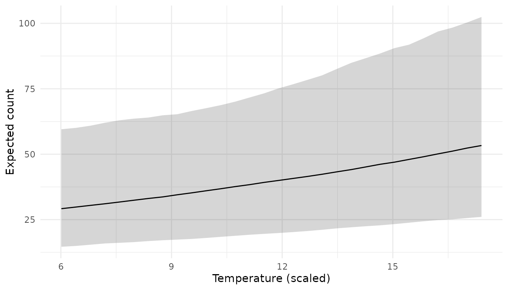
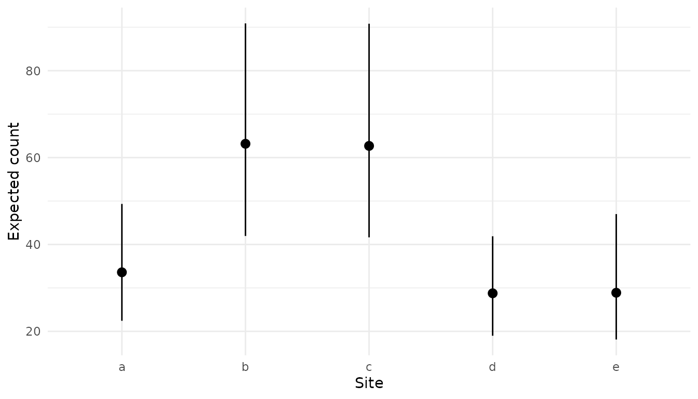
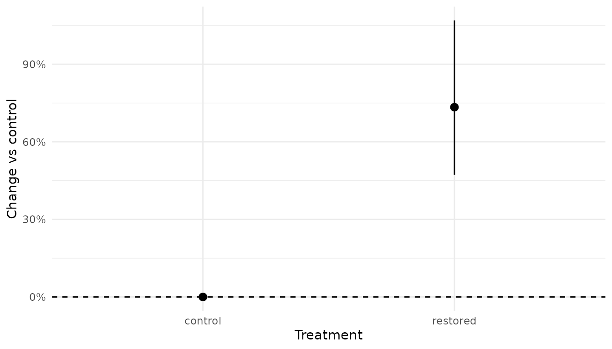
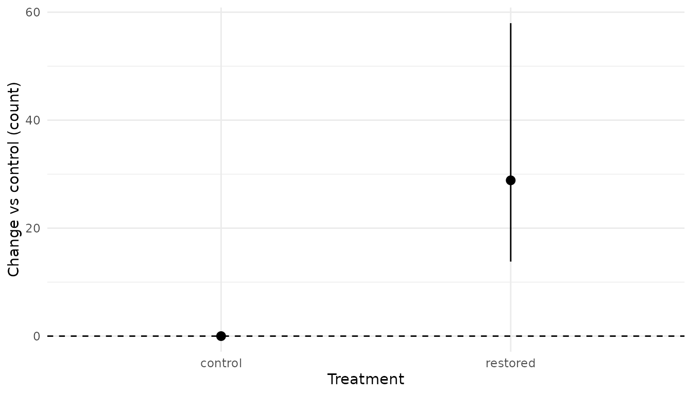
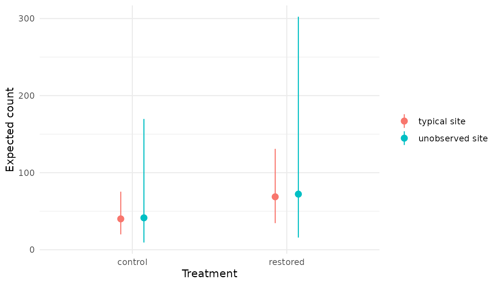

# Prediction with predict() and Related Functions

[`predict.mb_analysis()`](https://poissonconsulting.github.io/embr/reference/predict.mb_analysis.md)
summarizes the posterior predictive distribution of a fitted Bayesian
model at new covariate values, returning a tidy data frame with point
estimates and compatibility limits. This vignette covers:

- [Covariate grids](#covariate-grids-with-the-newdata-helpers) built
  with the `newdata` helpers.
- [Scalar quantities from `new_expr`](#scalar-quantities-from-new_expr).
- [Random-effect zeroing](#random-effect-zeroing) control.
- [Reference data and effect sizes](#reference-data-and-effect-sizes),
  e.g., for proportional change.
- [Predicting for an unobserved
  level](#predicting-for-an-unobserved-level) to include amongst-level
  variation.
- [Overriding `new_expr` and injecting
  constants](#overriding-new_expr-and-injecting-constants) for ad-hoc
  derived quantities.
- [Group-level summaries with
  `mcmc_derive_data()`](#group-level-summaries-with-mcmc_derive_data).
- [Combining across analyses with
  `combine_samples()`](#combining-across-analyses-with-combine_samples)
  for joining and summarizing samples from independent fits.
- [Scalar derived quantities with
  `mcmc_derive()`](#scalar-derived-quantities-with-mcmc_derive) and
  arithmetic on raw `mcmcr` posteriors.
- [Cheat sheet](#cheat-sheet) mapping common goals to tools.

``` r

library(embr)
library(smbr2)
library(newdata)
library(mcmcr)
library(mcmcderive)
library(dplyr)
library(ggplot2)
```

## Setup: fit demo model

A simple example fish count model is fit with Stan (via cmdstanr and
smbr2). The simulated data has 5 sites × 5 years × 2 treatments, with an
unbalanced design (i.e., not all sites have all years with data).

``` r

count_code <- "
data {
  int<lower=2> nObs;
  int<lower=1> nsite;
  int<lower=1> nannual;
  int<lower=1> ntreatment;
  array[nObs] int<lower=1> site;
  array[nObs] int<lower=1> annual;
  array[nObs] int<lower=1> treatment;
  vector[nObs] temperature;
  array[nObs] int<lower=0> count;
}
parameters {
  real bIntercept;
  vector[ntreatment - 1] bTreatment_dev;
  real bTemp;
  real<lower=0> sSite;
  real<lower=0> sAnnual;
  real<lower=0> bPhi;
  vector[nsite] z_bSite;
  vector[nannual] z_bAnnual;
}
model {
  vector[nsite] bSite = z_bSite * sSite;
  vector[nannual] bAnnual = z_bAnnual * sAnnual;
  vector[ntreatment] bTreatment;
  bTreatment[1] = 0;
  for (k in 2:ntreatment) bTreatment[k] = bTreatment_dev[k - 1];

  vector[nObs] log_eCount;
  for (i in 1:nObs) {
    log_eCount[i] = bIntercept + bTreatment[treatment[i]] +
                    bTemp * temperature[i] + bSite[site[i]] +
                    bAnnual[annual[i]];
  }

  bIntercept ~ normal(0, 5);
  bTreatment_dev ~ normal(0, 5);
  bTemp ~ normal(0, 5);
  sSite ~ exponential(1);
  sAnnual ~ exponential(1);
  bPhi ~ gamma(2, 0.5);
  to_vector(z_bSite) ~ std_normal();
  to_vector(z_bAnnual) ~ std_normal();

  count ~ neg_binomial_2_log(log_eCount, bPhi);
}
"

count_model <- model(
  code = count_code,
  new_expr = {
    bSite <- z_bSite * sSite
    bAnnual <- z_bAnnual * sAnnual
    bTreatment <- c(0, bTreatment_dev)
    eBaseCount <- exp(bIntercept)
    eRestoredEffect <- exp(bTreatment_dev[1])
    for (i in 1:nObs) {
      log(eCount[i]) <- bIntercept +
        bTreatment[treatment[i]] +
        bTemp * temperature[i] +
        bSite[site[i]] +
        bAnnual[annual[i]]
      prediction[i] <- eCount[i]
      fit[i] <- eCount[i]
      unobserved[i] <- exp(
        bIntercept +
          bTreatment[treatment[i]] +
          bTemp * temperature[i] +
          rnorm(1, 0, sSite) +
          rnorm(1, 0, sAnnual)
      )
      log_lik[i] <- log_lik_neg_binom(count[i], eCount[i], bPhi)
    }
  },
  new_expr_vec = TRUE,
  select_data = list(
    count = 1L,
    site = factor("a"),
    annual = factor("a"),
    treatment = factor("a"),
    `temperature*` = 1
  ),
  random_effects = list(
    z_bSite = "site",
    z_bAnnual = "annual"
  )
)
```

``` r

analysis <- analyse(
  count_model,
  data = data,
  stan_engine = "cmdstan-mcmc",
  nchains = 3L,
  niters = 500L,
  niters_warmup = 500L,
  seed = 42L,
  parallel = TRUE,
  quiet = TRUE,
  beep = FALSE
)
#> # A tibble: 1 × 11
#>       n     K nchains niters nthin   ess  rhat converged num_divergent
#>   <int> <int>   <int>  <int> <int> <int> <dbl> <lgl>             <dbl>
#> 1   132     6       3    500     1   414  1.00 FALSE                 0
#> # ℹ 2 more variables: max_treedepth <int>, ebfmi <dbl>

coef(analysis, include_constant = FALSE, simplify = TRUE) |>
  mutate(across(estimate:svalue, ~ signif(.x, 3)))
#> # A tibble: 6 × 5
#>   term           estimate  lower upper svalue
#>   <term>            <dbl>  <dbl> <dbl>  <dbl>
#> 1 bIntercept        3.69  2.99   4.32   10.6 
#> 2 bPhi              4.13  3.13   5.41   10.6 
#> 3 bTemp             0.109 0.0203 0.193   6.38
#> 4 bTreatment_dev    0.55  0.387  0.727  10.6 
#> 5 sAnnual           0.267 0.113  0.782  10.6 
#> 6 sSite             0.464 0.232  1.25   10.6
```

## Default prediction

With no `new_data`, [`predict()`](https://rdrr.io/r/stats/predict.html)
returns predicted values for every row of the analysis dataset. This is
pulled from the `prediction[i]` line in `new_expr`:

``` r

predict(analysis) |> head()
#> # A tibble: 6 × 9
#>   count site  annual treatment temperature estimate lower upper svalue
#>   <int> <fct> <fct>  <fct>           <dbl>    <dbl> <dbl> <dbl>  <dbl>
#> 1    55 a     1      control          14.7     51.4  38.4  69.0   10.6
#> 2    55 b     1      control          10.9     78.3  59.9 104.    10.6
#> 3    19 c     1      control          12.7     85.6  65.9 112.    10.6
#> 4    51 d     1      control          13.3     40.7  31.1  53.2   10.6
#> 5    11 a     2      control          12.8     31.4  23.7  42.4   10.6
#> 6    53 b     2      control          11.8     56.1  42.1  74.7   10.6
```

## Covariate grids with the `newdata` helpers

Covariate grids can be generated with
[`newdata::xnew_data()`](https://poissonconsulting.github.io/newdata/reference/xnew_data.html).
Covariates not specified are held at a reference value: mean for
continuous, first level for factors. For categorical fixed effects this
is the literal first level; for random-effect factors at the first
level, that random effect is zeroed by default — see *Random-effect
zeroing* below.

### Continuous covariate

By default, specifying the name of a continuous covariate will generate
a sequence from min to max, with length 30. Notice factors (e.g., site)
are held at the first level.

``` r

temp_data <- xnew_data(data, temperature)
head(temp_data)
#> # A tibble: 6 × 5
#>   count site  annual treatment temperature
#>   <int> <fct> <fct>  <fct>           <dbl>
#> 1    62 a     1      control          6.01
#> 2    62 a     1      control          6.41
#> 3    62 a     1      control          6.80
#> 4    62 a     1      control          7.19
#> 5    62 a     1      control          7.58
#> 6    62 a     1      control          7.98
nrow(temp_data)
#> [1] 30

pred_temp <- predict(analysis, new_data = temp_data)

head(pred_temp)
#> # A tibble: 6 × 9
#>   count site  annual treatment temperature estimate lower upper svalue
#>   <int> <fct> <fct>  <fct>           <dbl>    <dbl> <dbl> <dbl>  <dbl>
#> 1    62 a     1      control          6.01     29.2  14.6  59.5   10.6
#> 2    62 a     1      control          6.41     29.8  15.0  60.1   10.6
#> 3    62 a     1      control          6.80     30.4  15.4  60.9   10.6
#> 4    62 a     1      control          7.19     31.1  15.9  62.0   10.6
#> 5    62 a     1      control          7.58     31.7  16.2  63.0   10.6
#> 6    62 a     1      control          7.98     32.4  16.4  63.6   10.6

plot_ribbon(pred_temp, temperature) +
  labs(y = "Expected count", x = "Temperature (scaled)")
```



### Specific values via `xnew_seq()` or with `=`

``` r

xnew_data(data, xnew_seq(temperature, length_out = 5)) |>
  predict(analysis, new_data = _)
#> # A tibble: 5 × 9
#>   count site  annual treatment temperature estimate lower upper svalue
#>   <int> <fct> <fct>  <fct>           <dbl>    <dbl> <dbl> <dbl>  <dbl>
#> 1    62 a     1      control          6.01     29.2  14.6  59.5   10.6
#> 2    62 a     1      control          8.86     33.9  17.2  65.0   10.6
#> 3    62 a     1      control         11.7      39.6  19.8  74.1   10.6
#> 4    62 a     1      control         14.6      45.9  22.7  88.0   10.6
#> 5    62 a     1      control         17.4      53.3  26.1 102.    10.6
```

``` r

xnew_data(data, temperature = 10) |>
  predict(analysis, new_data = _)
#> # A tibble: 1 × 9
#>   count site  annual treatment temperature estimate lower upper svalue
#>   <int> <fct> <fct>  <fct>           <dbl>    <dbl> <dbl> <dbl>  <dbl>
#> 1    62 a     1      control            10     36.1  18.1  67.7   10.6
```

Note that any rescaling transformations are automatically handled by
[`predict()`](https://rdrr.io/r/stats/predict.html).

### Single factor

Generate a row for each level of site. Notice that temperature is held
at mean value.

``` r

pred_site <- xnew_data(data, site) |>
  predict(analysis, new_data = _)

pred_site
#> # A tibble: 5 × 9
#>   count site  annual treatment temperature estimate lower upper svalue
#>   <int> <fct> <fct>  <fct>           <dbl>    <dbl> <dbl> <dbl>  <dbl>
#> 1    62 a     1      control          11.9     33.6  22.4  49.3   10.6
#> 2    62 b     1      control          11.9     63.2  42.0  90.9   10.6
#> 3    62 c     1      control          11.9     62.7  41.6  90.8   10.6
#> 4    62 d     1      control          11.9     28.8  19.0  41.9   10.6
#> 5    62 e     1      control          11.9     28.9  18.1  47.0   10.6

plot_pointrange(pred_site, site) +
  labs(y = "Expected count", x = "Site")
```



### `xobs_only()` for observed combinations only

By default `xnew_data(data, site, annual)` returns the full 25-row
crossed grid:

``` r

xnew_data(data, site, annual) |>
  predict(analysis, new_data = _) |>
  nrow()
#> [1] 25
```

If you only want predictions for the (`site`, `annual`) combinations
actually observed in the data, wrap them in
[`xobs_only()`](https://poissonconsulting.github.io/newdata/reference/xobs_only.html):

``` r

xnew_data(data, xobs_only(site, annual)) |>
  predict(analysis, new_data = _) |>
  nrow()
#> [1] 22
```

22 rows instead of 25: the unbalanced combinations from the design (site
`e` is missing from years 1, 2, and 3).

### Casting specific factor levels with `xcast()`

To get specific values of factors, use
[`xcast()`](https://poissonconsulting.github.io/newdata/reference/xcast.html).

``` r

xnew_data(
  data,
  xcast(site = "a", treatment = "restored"),
  temperature = 1
) |>
  predict(analysis, new_data = _)
#> # A tibble: 1 × 9
#>   count site  annual treatment temperature estimate lower upper svalue
#>   <int> <fct> <fct>  <fct>           <dbl>    <dbl> <dbl> <dbl>  <dbl>
#> 1    62 a     1      restored            1     39.0  17.8  89.3   10.6
```

Note that `xnew_data(data, site = "a")` will not work: bare `=`
assignment is for *continuous* covariates (e.g., `temperature = 1`). To
fix a factor at a specific level, wrap it in
[`xcast()`](https://poissonconsulting.github.io/newdata/reference/xcast.html).

## Scalar quantities from `new_expr`

Pass `new_data = character(0)` to extract a scalar quantity defined in
`new_expr`. `term` selects which scalar:

``` r

predict(analysis, new_data = character(0), term = "eBaseCount")
#> # A tibble: 1 × 9
#>   count site  annual treatment temperature estimate lower upper svalue
#>   <int> <fct> <fct>  <fct>           <dbl>    <dbl> <dbl> <dbl>  <dbl>
#> 1    62 a     1      control          11.9     40.1  19.9  75.3   10.6
predict(analysis, new_data = character(0), term = "eRestoredEffect")
#> # A tibble: 1 × 9
#>   count site  annual treatment temperature estimate lower upper svalue
#>   <int> <fct> <fct>  <fct>           <dbl>    <dbl> <dbl> <dbl>  <dbl>
#> 1    62 a     1      control          11.9     1.73  1.47  2.07   10.6
```

## Random-effect zeroing

By default (`random_effects = NULL`), a random-effect parameter is
zeroed when its associated factor is held at the first level in
`new_data`. This gives the prediction for the ‘typical’
(population-level) group.

### Default behaviour

For example, `xnew_data(data, temperature)` leaves both `site` and
`annual` at level 1, so both `z_bSite` and `z_bAnnual` are zeroed,
giving the population-level prediction:

``` r

xnew_data(data, temperature) |>
  predict(analysis, new_data = _) |>
  head(3)
#> # A tibble: 3 × 9
#>   count site  annual treatment temperature estimate lower upper svalue
#>   <int> <fct> <fct>  <fct>           <dbl>    <dbl> <dbl> <dbl>  <dbl>
#> 1    62 a     1      control          6.01     29.2  14.6  59.5   10.6
#> 2    62 a     1      control          6.41     29.8  15.0  60.1   10.6
#> 3    62 a     1      control          6.80     30.4  15.4  60.9   10.6
```

### `random_effects = FALSE`

If `random_effects = FALSE`, zeroing is skipped and predictions use the
literal first level of each random-effect factor (here, `site = "a"` and
`annual = 1`).

``` r

xnew_data(data, temperature) |>
  predict(analysis, new_data = _, random_effects = FALSE) |>
  head(3)
#> # A tibble: 3 × 9
#>   count site  annual treatment temperature estimate lower upper svalue
#>   <int> <fct> <fct>  <fct>           <dbl>    <dbl> <dbl> <dbl>  <dbl>
#> 1    62 a     1      control          6.01     32.3  22.2  48.0   10.6
#> 2    62 a     1      control          6.41     32.9  22.9  48.3   10.6
#> 3    62 a     1      control          6.80     33.6  23.7  48.9   10.6
```

### Named list: zero a subset of random effects

Passing a named list overrides the `random_effects` defined in
[`model()`](https://poissonconsulting.github.io/embr/reference/model.md),
restricting the set of parameters eligible for zeroing to those listed.
Parameters not in the list are kept at their literal value for the first
level of their associated factor in `new_data`. This is useful when you
want to marginalize over one random effect while keeping another at a
specific level.

``` r

xnew_data(data, temperature) |>
  predict(
    analysis,
    new_data = _,
    random_effects = list(z_bSite = "site")
  ) |>
  head(3)
#> # A tibble: 3 × 9
#>   count site  annual treatment temperature estimate lower upper svalue
#>   <int> <fct> <fct>  <fct>           <dbl>    <dbl> <dbl> <dbl>  <dbl>
#> 1    62 a     1      control          6.01     38.9  20.1  71.7   10.6
#> 2    62 a     1      control          6.41     39.7  20.6  72.8   10.6
#> 3    62 a     1      control          6.80     40.6  21.2  73.3   10.6
```

For the call above (with `site` and `annual` both at level 1 in
`new_data`):

- `z_bSite` is listed and `site` is at level 1, so `z_bSite` is zeroed
  (population-mean site, i.e. averaged across sites).
- `z_bAnnual` is *not* listed, so it is kept at its literal value for
  `annual = 1` — the specific year-1 effect.

This gives the prediction averaged across sites but anchored to year 1
specifically.

## Reference data and effect sizes

`ref_data` must be a flag or a data.frame with one row. When `ref_data`
is a one-row data frame,
[`predict()`](https://rdrr.io/r/stats/predict.html) computes
`ref_fun2(c(ref_draw, new_draw))` per MCMC iteration, where each element
is the scalar posterior draw at the reference row and the `new_data` row
respectively. The returned summary describes the posterior of the
*transformed* quantity, not of the raw prediction. The default
`ref_fun2` is `proportional_change2` from the `extras` package
(`(new - ref) / ref`), which gives the proportional change of each row
in `new_data` with the `ref_data`. When `ref_data` is `TRUE`, a one-row
data.frame is automatically generated with all variables held at
reference value.

### Proportional change vs control

``` r

ref_control <- xnew_data(data, xcast(treatment = "control"))

pred_prop <- xnew_data(data, treatment) |>
  predict(analysis, new_data = _, ref_data = ref_control)

pred_prop
#> # A tibble: 2 × 9
#>   count site  annual treatment temperature estimate lower upper svalue
#>   <int> <fct> <fct>  <fct>           <dbl>    <dbl> <dbl> <dbl>  <dbl>
#> 1    62 a     1      control          11.9    0     0      0       0  
#> 2    62 a     1      restored         11.9    0.734 0.472  1.07   10.6

plot_pointrange(pred_prop, treatment) +
  geom_hline(yintercept = 0, linetype = "dashed") +
  scale_y_continuous(labels = scales::percent) +
  labs(y = "Change vs control", x = "Treatment")
```



The control row sits at exactly 0%. The restored row gives the
proportional change in expected count.

### Custom `ref_fun2`: e.g., absolute difference

Pass any function whose first argument takes a vector of two numbers and
returns a scalar to summarize a different transformation of the two
posteriors. For example, absolute difference reports the effect on the
count scale (restored minus control) rather than as a percentage:

``` r

pred_diff <- xnew_data(data, treatment) |>
  predict(
    analysis,
    new_data = _,
    ref_data = ref_control,
    ref_fun2 = function(x) x[2] - x[1]
  )

pred_diff
#> # A tibble: 2 × 9
#>   count site  annual treatment temperature estimate lower upper svalue
#>   <int> <fct> <fct>  <fct>           <dbl>    <dbl> <dbl> <dbl>  <dbl>
#> 1    62 a     1      control          11.9      0     0     0      0  
#> 2    62 a     1      restored         11.9     28.9  13.8  58.0   10.6

plot_pointrange(pred_diff, treatment) +
  geom_hline(yintercept = 0, linetype = "dashed") +
  labs(y = "Change vs control (count)", x = "Treatment")
```



## Predicting for an unobserved level

Zeroing a random effect gives the prediction for the *typical* or
*average* group level, e.g., expected count for an average site, with
amongst-site variability removed. However, for a *new*, *unobserved*
level the uncertainty should be wider to account for amongst-level
variation. This is done by drawing a new random effect from its
population distribution, which typically will incorporate mean 0 (for
random effects centred at 0) and the SD of the random effect, which is
estimated. The model’s `new_expr` already defines an `unobserved` term
to do this:

``` r

unobserved[i] <- exp(bIntercept +
  bTreatment[treatment[i]] +
  bTemp * temperature[i] +
  rnorm(1, 0, sSite) +
  rnorm(1, 0, sAnnual))
```

Setting `term = "unobserved"` tells
[`predict()`](https://rdrr.io/r/stats/predict.html) to summarize this
named quantity from `new_expr` instead of the default `"prediction"`.
Compare the two scopes side-by-side:

``` r

typical <- xnew_data(data, treatment) |>
  predict(analysis, new_data = _) |>
  mutate(scope = "typical site")

unobserved <- xnew_data(data, treatment) |>
  predict(analysis, new_data = _, term = "unobserved") |>
  mutate(scope = "unobserved site")

bind_rows(typical, unobserved)
#> # A tibble: 4 × 10
#>   count site  annual treatment temperature estimate lower upper svalue scope    
#>   <int> <fct> <fct>  <fct>           <dbl>    <dbl> <dbl> <dbl>  <dbl> <chr>    
#> 1    62 a     1      control          11.9     40.1 19.9   75.3   10.6 typical …
#> 2    62 a     1      restored         11.9     68.7 34.5  131.    10.6 typical …
#> 3    62 a     1      control          11.9     41.4  9.38 170.    10.6 unobserv…
#> 4    62 a     1      restored         11.9     72.2 15.8  302.    10.6 unobserv…
```

``` r

bind_rows(typical, unobserved) |>
  ggplot(aes(treatment, estimate, ymin = lower, ymax = upper, colour = scope)) +
  geom_pointrange(position = position_dodge(width = 0.3)) +
  theme_minimal() +
  labs(y = "Expected count", x = "Treatment", colour = NULL)
```



Compatibility limits are wider for `unobserved site`, as the interval
now reflects amongst-site variation in addition to parameter
uncertainty.

## Overriding `new_expr` and injecting constants

`new_expr` can be replaced inline as a string. `new_values` supplies
named scalar constants into that expression’s environment. For example,
convert counts to biomass by multiplying through a literature or
independently measured mean fish mass (g), without refitting the count
model:

``` r

xnew_data(data, site) |>
  predict(analysis, new_data = _) |>
  head(2)
#> # A tibble: 2 × 9
#>   count site  annual treatment temperature estimate lower upper svalue
#>   <int> <fct> <fct>  <fct>           <dbl>    <dbl> <dbl> <dbl>  <dbl>
#> 1    62 a     1      control          11.9     33.6  22.4  49.3   10.6
#> 2    62 b     1      control          11.9     63.2  42.0  90.9   10.6

predict(
  analysis,
  new_data = xnew_data(data, site),
  new_expr = "
    bSite <- z_bSite * sSite
    for (i in 1:length(site)) {
      prediction[i] <- exp(bIntercept + bSite[site[i]]) * mean_mass_g
    }
  ",
  new_values = list(mean_mass_g = 12)
) |>
  head(2)
#> # A tibble: 2 × 9
#>   count site  annual treatment temperature estimate lower upper svalue
#>   <int> <fct> <fct>  <fct>           <dbl>    <dbl> <dbl> <dbl>  <dbl>
#> 1    62 a     1      control          11.9     403.  269.  592.   10.6
#> 2    62 b     1      control          11.9     758.  503. 1091.   10.6
```

The second call multiplies the predicted count by an external mean mass
of 12 g, giving the posterior of expected biomass per site.
Compatibility limits scale proportionally because the constant has no
uncertainty attached.

## Group-level summaries with `mcmc_derive_data()`

[`mcmc_derive_data()`](https://rdrr.io/pkg/mcmcdata/man/mcmc_derive_data.html)
pairs MCMC samples with the per-row data and returns an `mcmc_data`
object.
[`group_by()`](https://dplyr.tidyverse.org/reference/group_by.html) +
[`summarize()`](https://dplyr.tidyverse.org/reference/summarise.html)
then aggregates across rows within each group per MCMC iteration to
produce per-group posterior distribution summaries.

### Total expected count per treatment

``` r

mcmc_derive_data(analysis, new_data = data, term = "^eCount$") |>
  group_by(treatment) |>
  summarize() |>
  coef()
#> # A tibble: 2 × 5
#>   treatment estimate lower upper svalue
#>   <fct>        <dbl> <dbl> <dbl>  <dbl>
#> 1 control      3101. 2712. 3569.   10.6
#> 2 restored     5250. 4613. 6059.   10.6
```

The default summary function is `sum`, which returns the posterior of
*total* abundance per treatment across all rows.

### Custom summary function

Provide any function via `.fun`. For example, the coefficient of
variation of expected count across rows within each treatment:

``` r

mcmc_derive_data(analysis, new_data = data, term = "^eCount$") |>
  group_by(treatment) |>
  summarize(.fun = function(x) sd(x) / mean(x)) |>
  coef()
#> # A tibble: 2 × 5
#>   treatment estimate lower upper svalue
#>   <fct>        <dbl> <dbl> <dbl>  <dbl>
#> 1 control      0.461 0.374 0.552   10.6
#> 2 restored     0.492 0.393 0.596   10.6
```

## Combining across analyses with `combine_samples()`

`mcmc_data` objects come from
[`mcmc_derive_data()`](https://rdrr.io/pkg/mcmcdata/man/mcmc_derive_data.html);
they hold the raw per-row MCMC samples together with the associated
data, without the point-estimate-and-limits summarisation that
[`predict()`](https://rdrr.io/r/stats/predict.html) performs.

[`mcmcr::combine_samples()`](https://poissonconsulting.github.io/mcmcr/reference/combine_samples.html)
(with the `mcmc_data` method from `mcmcdata`) joins two `mcmc_data`
objects on shared data columns and applies a function to align MCMC
draws row-by-row. Its natural use is composing quantities derived from
*independent* analyses: for example, multiplying an abundance posterior
by a mass-per-fish posterior to get biomass, where each component was
fitted from a different dataset.

Assume a separate `mass_analysis` was fitted to size-measurement data
(different observation model, same site factor), and both analyses
expose a per-site quantity:

``` r

# Abundance posterior per site, from the counts model fitted above
abundance <- mcmc_derive_data(
  analysis,
  new_data = xnew_data(data, site),
  term = "^eCount$"
)

# Mass-per-fish posterior per site, from a separate analysis (sketch)
mass_per_fish <- mcmc_derive_data(
  mass_analysis,
  new_data = xnew_data(mass_data, site),
  term = "^eMass$"
)

# Per-site biomass posterior: abundance * mass-per-fish
biomass <- mcmcr::combine_samples(
  abundance,
  mass_per_fish,
  by = "site",
  fun = prod
)
```

`by` names the data columns to join on (here `site`); rows present in
both inputs are paired. `fun` is applied to the matched MCMC draws, so
`prod` gives the row-wise product across iterations. The result is an
`mcmc_data` with one row per joined key and a propagated posterior in
`biomass`.

For the two analyses to combine:

- **MCMC dimensions must match.** Both fits need the same number of
  chains and iterations (e.g. both 3 chains × 500 saved draws).
  [`combine_samples()`](https://poissonconsulting.github.io/mcmcr/reference/combine_samples.html)
  pairs draws position-by-position; mismatched dimensions error out.
- **`by` columns must exist in both `$data` slots.** Rows are paired by
  an inner join, so non-matching rows are dropped silently. Make sure
  factor levels and column types line up.

Within a single analysis, prefer expressing the composition directly in
`new_expr`;
[`combine_samples()`](https://poissonconsulting.github.io/mcmcr/reference/combine_samples.html)
is most useful when the components come from independently fitted models
whose draws need joining.

## Scalar derived quantities with `mcmc_derive()`

[`mcmc_derive()`](https://poissonconsulting.github.io/mcmcderive/reference/mcmc_derive.html)
returns the raw MCMC samples for one or more scalar terms in `new_expr`.
As with
[`mcmc_derive_data()`](https://rdrr.io/pkg/mcmcdata/man/mcmc_derive_data.html),
this is useful when you want to work with the raw MCMC samples directly
rather than [`predict()`](https://rdrr.io/r/stats/predict.html)’s
estimate-and-limits summary.

### Pull related scalars by regex

Unlike [`predict()`](https://rdrr.io/r/stats/predict.html), the `term`
argument in
[`mcmc_derive()`](https://poissonconsulting.github.io/mcmcderive/reference/mcmc_derive.html)
can accept a regular expression. For example, both `eBaseCount` and
`eRestoredEffect` are extracted in one call:

``` r

scalars <- mcmc_derive(
  analysis,
  new_data = character(0),
  term = "^(eBaseCount|eRestoredEffect)$"
)

coef(scalars)
#> # A tibble: 2 × 5
#>   term            estimate lower upper svalue
#>   <term>             <dbl> <dbl> <dbl>  <dbl>
#> 1 eBaseCount         40.1  19.9  75.3    10.6
#> 2 eRestoredEffect     1.73  1.47  2.07   10.6
```

[`coef()`](https://rdrr.io/r/stats/coef.html) is run on the
[`mcmc_derive()`](https://poissonconsulting.github.io/mcmcderive/reference/mcmc_derive.html)
output to get point estimates with compatibility limits.

### Arithmetic on `mcmcr` objects

Quantities you anticipate are usually cleanest to define directly in
`new_expr` and pull with
[`predict()`](https://rdrr.io/r/stats/predict.html). Raw `mcmcr`
arithmetic earns its keep when the question requires *composing* outputs
of different post-fit operations — for example, combining a
group-aggregated quantity from
[`mcmc_derive_data()`](https://rdrr.io/pkg/mcmcdata/man/mcmc_derive_data.html)
with a scalar from
[`mcmc_derive()`](https://poissonconsulting.github.io/mcmcderive/reference/mcmc_derive.html),
or producing summaries
[`predict()`](https://rdrr.io/r/stats/predict.html) cannot (probability
statements, custom posterior quantiles).

First, get totals per treatment, then extract each row as raw MCMC
draws:

``` r

totals <- mcmc_derive_data(analysis, new_data = data, term = "^eCount$") |>
  group_by(treatment) |>
  summarize()

restored_total <- as.mcmcr(filter(totals, treatment == "restored"))[[1]]
control_total <- as.mcmcr(filter(totals, treatment == "control"))[[1]]
```

The posterior of the absolute difference in total expected catch
(restored minus control), summed over the observed design — a
count-scale effect size that `eRestoredEffect` (a multiplicative ratio)
doesn’t quantify:

``` r

extra_catch <- restored_total - control_total
coef(extra_catch)
#> # A tibble: 1 × 5
#>   term      estimate lower upper svalue
#>   <term>       <dbl> <dbl> <dbl>  <dbl>
#> 1 parameter    2147. 1450. 3010.   10.6
```

And the posterior probability that restoration adds at least 2000 fish
in total — a question
[`predict()`](https://rdrr.io/r/stats/predict.html) cannot answer:

``` r

mean(extra_catch >= 2000)
#> [1] 0.6606667
```

## Cheat sheet

| Goal | Tool |
|----|----|
| Posterior summary at new covariate values | [`predict()`](https://rdrr.io/r/stats/predict.html) |
| Posterior summary for a scalar derived quantity | [`predict()`](https://rdrr.io/r/stats/predict.html) with `new_data = character(0)` and `term` specified |
| Prediction for an unobserved factor level (includes amongst-level variation) | `new_expr` term with `rnorm(1, 0, s*)` for the random effect |
| Effect size (proportional, absolute) | [`predict()`](https://rdrr.io/r/stats/predict.html) with `ref_data` + `ref_fun2` |
| Group-level aggregates (sum, mean, custom) per MCMC iteration | [`mcmc_derive_data()`](https://rdrr.io/pkg/mcmcdata/man/mcmc_derive_data.html) + [`group_by()`](https://dplyr.tidyverse.org/reference/group_by.html) + [`summarize()`](https://dplyr.tidyverse.org/reference/summarise.html) |
| Combine quantities derived from independent analyses | [`mcmcr::combine_samples()`](https://poissonconsulting.github.io/mcmcr/reference/combine_samples.html) |
| Scalar parameter posteriors and arithmetic | [`mcmc_derive()`](https://poissonconsulting.github.io/mcmcderive/reference/mcmc_derive.html) |

See
[`?predict.mb_analysis`](https://poissonconsulting.github.io/embr/reference/predict.mb_analysis.md),
[`?mcmc_derive.mb_analysis`](https://poissonconsulting.github.io/embr/reference/mcmc_derive.mb_analysis.md),
[`?mcmc_derive_data.mb_analysis`](https://poissonconsulting.github.io/embr/reference/mcmc_derive_data.mb_analysis.md),
and
[`?mcmcr::combine_samples`](https://poissonconsulting.github.io/mcmcr/reference/combine_samples.html)
for full argument documentation.
